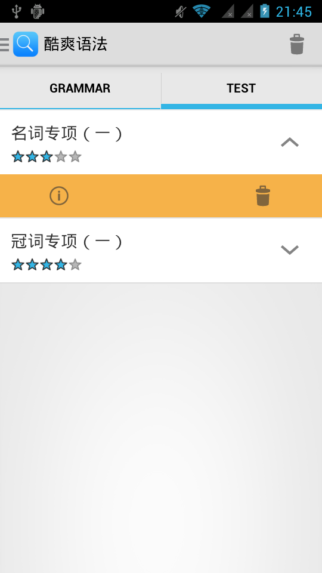

酷爽英语语法
===========

### 简介

一款英语初级学习APP，并带有测试功能，还支持词库下载。云端词库由我自己写成，服务器架在SAE上，使用PHP写成，传输格式为xml.

### 依赖

android-support-v7-appcompat.jar  
android-support-v4-appcompat.jar  
open source architecture PagerSlidingTabStrip  

### 有图有真相 android 4.2的系统

### 链接

1. [百度手机助手上的应用下载地址](http://shouji.baidu.com/soft/item?docid=7201034&from=landing&f=search_app_%E9%85%B7%E7%88%BD%E8%AF%AD%E6%B3%95%40list_1_title%401%40header_all_input)
2. [最新版本下载地址](http://1.coolgrammar.sinaapp.com/coolgrammar/Coolgrammer.apk)
